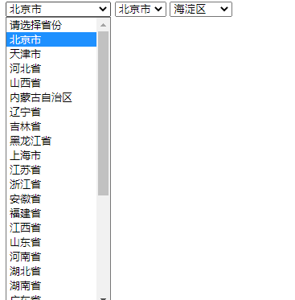

# jsLevelLinkage

# 完成层级联动效果




 利用了code编码的属性 前两位代表省  中间两位代表市 后面两位代表县

```javascript
<script>
        // console.log(city[1]);
        var province = document.querySelector('#province');
        var city = document.querySelector('#city');
        var county = document.querySelector('#county');
        for (var i = 0; i < provinceS.length; i++) {
            var opt = document.createElement('option');
            //动态创建节点
            opt.setAttribute('value', provinceS[i].item_code);
            opt.innerHTML = provinceS[i].item_name;
            province.appendChild(opt);
        } //这里是动态创建省的节点；
        //------------下面根据选择的省去创建市
        province.addEventListener('change', function () {
            city.innerHTML = ''; //清空本来的列表
            county.innerHTML = '';
            var provinceId = this.value;
            provinceId = provinceId / 10000;
            init(city); //初始化
            // console.log(provinceId);
            // console.log(typeof provinceId);
            for (var i = 0; i < cityS.length; i++) {
                var citySid = Math.floor(cityS[i].item_code / 10000);
                // console.log(typeof citySid);
                // console.log(citySid);
                if (citySid == provinceId) {
                    var opt = document.createElement('option');
                    //动态创建节点
                    opt.setAttribute('value', cityS[i].item_code);
                    opt.innerHTML = cityS[i].item_name;
                    city.appendChild(opt);
                }
            } //添加了各种市
        })

        // province.onchange();
        city.addEventListener('change', function () {
            county.innerHTML = '';
            var citySid = this.value;
            citySid = citySid / 100;
            init(county); //初始化
            for (let i = 0; i < countyS.length; i++) {
                // console.log(countyS[i]);
                var countyId = Math.floor(countyS[i].item_code / 100);
                // console.log(countyId);
                if (countyId === citySid) {
                    var opt = document.createElement('option');
                    //动态创建节点
                    opt.setAttribute('value', countyS[i].item_code);
                    opt.innerHTML = countyS[i].item_name;
                    county.appendChild(opt);
                }
            }
        })

        function init(ele) {
            var opt = document.createElement('option');
            opt.setAttribute('value', 000);
            opt.innerHTML = '请选择';
            ele.appendChild(opt);
        }
    </script>
```

将城市代码分别存储在三个不同的js文件中用不同的数组保存 方便调用

